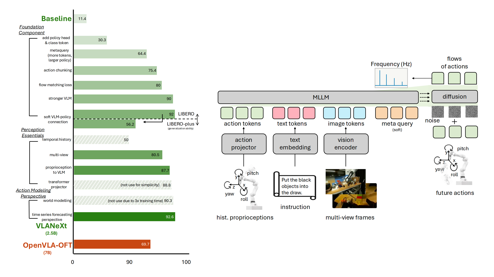

# VLANeXt: Recipes for Building Strong VLA Models

Official implement of VLANeXt | [Paper]() | [Personal Homepage](https://dravenalg.github.io/).

**Xiao-Ming Wu**, Bin Fan, Kang Liao, Jian-Jian Jiang, Runze Yang, Yihang Luo, Zhonghua Wu, Wei-Shi Zheng, Chen Change Loy*.

If you have any questions, feel free to contact me by xiaoming.wu@ntu.edu.sg.

